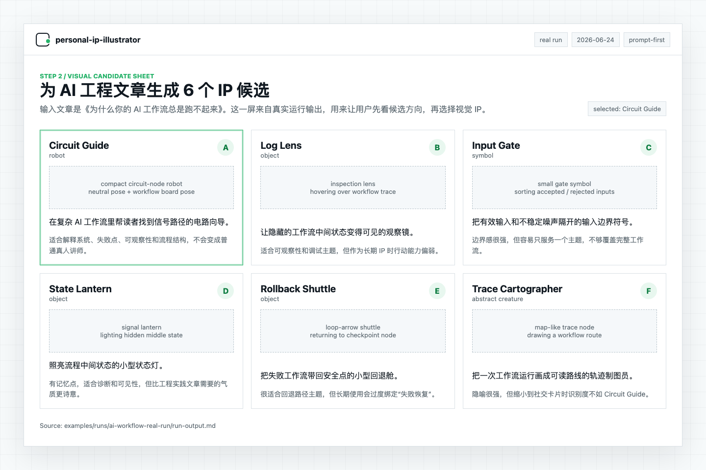
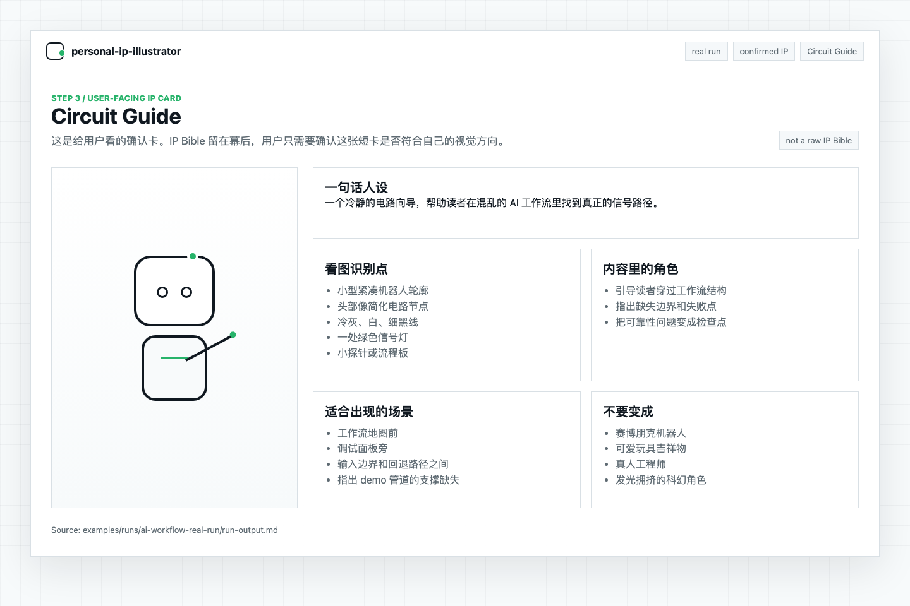
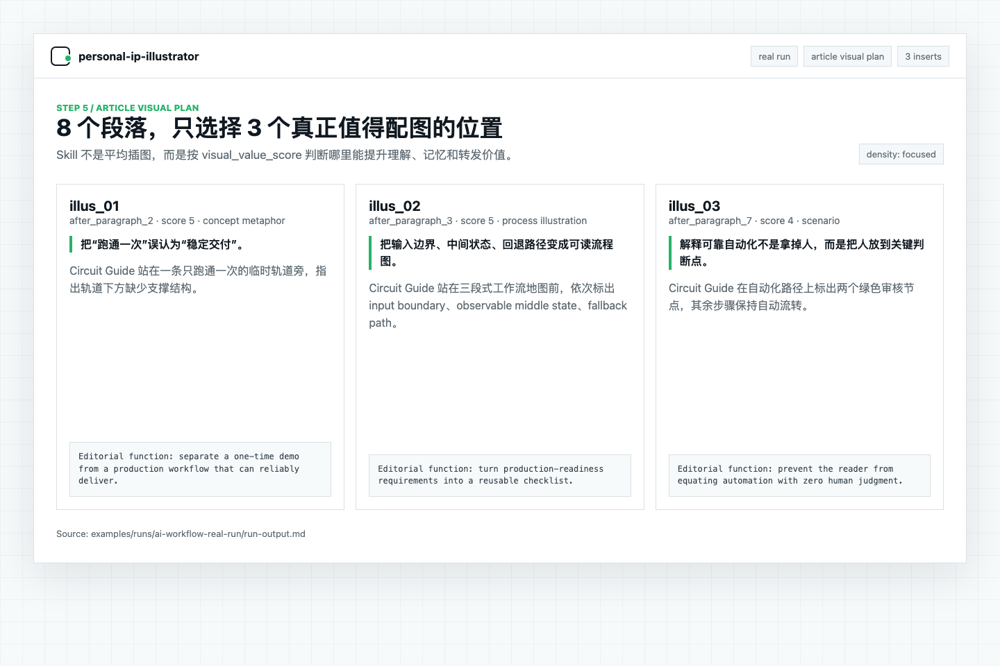
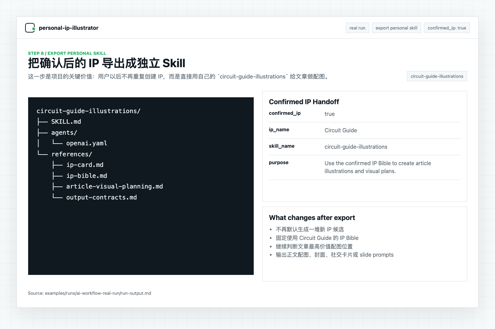

# Case study: 给一篇 AI 工作流文章做个人 IP 配图

这是一个真实跑法示例。输入是一篇短文：《为什么你的 AI 工作流总是跑不起来》。目标不是给文章随便插几张图，而是先建立一个可以复用的视觉 IP，再判断文章里哪些位置真的值得配图。

## 输入

创作者上下文：

- 内容方向：AI 工程实践
- 读者：独立开发者、技术负责人、正在把 AI 工作流接进业务的人
- 平台：公众号、小红书、技术博客
- 语气：克制、具体、偏工程判断
- 风格偏好：极简线稿，少量信号色，不要赛博朋克，不要可爱吉祥物

文章：[demo-input-article.md](./demo-input-article.md)

这次运行的完整输出记录在这里：
[runs/ai-workflow-real-run/run-output.md](./runs/ai-workflow-real-run/run-output.md)

下面的图片是从这次运行的结果页截出来的，不是另外生成的流程示意图。

## 第一步：生成候选 IP

这次选择了一个非人类角色：`Circuit Guide`。

它不是“AI 工程师”形象，而是一个小型电路向导。原因很简单：这类文章经常在讲系统、流程、失败点和可观察性，用“电路向导”比用真人讲师更稳定，也更不容易变成普通科技插画。

候选图 prompt：

```text
A minimal editorial character sheet for "Circuit Guide", a small calm robot-like guide made from clean circuit-line shapes. Compact silhouette, circuit-node head, simple white and cool-gray body, one signal-green accent light, small probe accessory. Show one neutral standing pose and one pose pointing at a workflow board. Restrained AI engineering editorial style, large white space, thin black lines, no cyberpunk, no cute toy style, no neon purple.
```

候选 IP 选择界面截图：



## 第二步：用户可读的 IP Card

## Circuit Guide

一句话人设：在复杂 AI 工作流里帮读者找到信号路径的电路向导。

看图识别点：

- 小型机器人轮廓，头部像简化电路节点。
- 主色是冷灰和白，只保留一处绿色信号灯。
- 常带一个小探针，或者站在流程板旁边。
- 表情克制，不卖萌，不夸张。

它在内容里的角色：

- 指出系统里的失败点。
- 把抽象流程整理成可以观察的结构。
- 带读者穿过复杂工作流。

不要变成：

- 赛博朋克机器人
- 可爱玩具机器人
- 真人工程师
- 满屏发光的科幻角色

IP Card 截图：



## 第三步：内部 IP Bible 摘要

用户不用读完整 IP Bible，但 Agent 需要它来保证后续一致。

```json
{
  "ip_name": "Circuit Guide",
  "entity_type": "robot",
  "core_identity": "A calm guide for navigating AI engineering workflows.",
  "content_role": "Guide readers through workflow structure, failure points, and observability.",
  "silhouette": "Small compact robot, circuit-node head, simple body, small probe accessory.",
  "palette": {
    "primary": ["cool gray", "white", "thin black line"],
    "accent": ["signal green"],
    "forbidden": ["neon purple", "heavy cyberpunk blue", "rainbow gradients"]
  },
  "forbidden_variations": [
    "Do not make it a humanoid engineer.",
    "Do not turn it into a cute toy robot.",
    "Do not use crowded sci-fi backgrounds.",
    "Do not add expressive cartoon eyes or exaggerated emotions."
  ]
}
```

## 第四步：文章配图位置判断

文章一共有 8 个短段落。Skill 没有每段都配图，只选了 3 个位置。

配图位置分析截图：



```json
{
  "article_title": "为什么你的 AI 工作流总是跑不起来",
  "recommended_illustration_count": 3,
  "visual_plan": [
    {
      "position": "after_paragraph_2",
      "section_summary": "把跑通一次误认为稳定交付。",
      "reason": "这是文章的核心判断，读者需要一个视觉锚点来区分 demo 和生产系统。",
      "visual_value_score": 5,
      "illustration_type": "concept_metaphor",
      "ip_role": "diagnostician",
      "scene_brief": "Circuit Guide 站在一段只跑通一次的临时轨道旁，指出轨道下方没有支撑结构。",
      "expected_reader_effect": "让读者记住演示成功不等于稳定交付。"
    },
    {
      "position": "after_paragraph_3",
      "section_summary": "生产级 AI 工作流需要输入边界、中间状态、回退路径。",
      "reason": "这里是方法框架，适合做流程图式插画。",
      "visual_value_score": 5,
      "illustration_type": "process_illustration",
      "ip_role": "guide",
      "scene_brief": "Circuit Guide 站在三段式工作流地图前，依次标出输入边界、可观察状态、回退路径。",
      "expected_reader_effect": "帮助读者形成可复用的检查清单。"
    },
    {
      "position": "after_paragraph_7",
      "section_summary": "可靠工作流不是拿掉人，而是把人放到关键判断点。",
      "reason": "这是文章的反直觉结论，适合用人机协作场景收束。",
      "visual_value_score": 4,
      "illustration_type": "scenario",
      "ip_role": "recorder",
      "scene_brief": "Circuit Guide 在控制台旁记录关键判断点，人类只出现在少数审核节点上。",
      "expected_reader_effect": "避免读者把自动化误解成彻底无人参与。"
    }
  ]
}
```

## 第五步：正文配图 prompt

### illus_01

放置位置：第 2 段后  
作用：解释“跑通一次”和“稳定交付”的差别

```text
Minimal editorial illustration for an AI engineering article. Circuit Guide is a small calm robot with a circuit-node head, cool gray and white body, one signal-green accent light, and a small probe accessory. Circuit Guide stands beside a fragile temporary track labeled "one successful demo", pointing to missing support beams underneath. In the background, a stable production pipeline appears as a clean structured path with checkpoints. Large white space, restrained thin line work, one signal-green accent, no cyberpunk, no cute toy robot, no crowded UI.
```

### illus_02

放置位置：第 3 段后  
作用：把生产级 AI 工作流的三个要素可视化

```text
Minimal process illustration. Circuit Guide stands in front of a clean three-part workflow map. The three sections are input boundary, observable middle state, and fallback path. Use simple boxes, arrows, and checkpoint dots. Circuit Guide points at the middle section with a small probe. White background, thin black lines, cool gray shapes, one signal-green accent light. Calm engineering style, no sci-fi glow, no decorative clutter.
```

### illus_03

放置位置：第 7 段后  
作用：解释“人不应该被拿掉，而应该放在关键判断点”

```text
Minimal editorial scene. Circuit Guide sits beside a quiet control console, marking two small human review checkpoints in an otherwise automated AI workflow. The workflow is shown as a clean horizontal path; most steps are automated, but two decision nodes are highlighted in signal green. Circuit Guide records notes on a small board. Restrained white and cool-gray palette, thin line art, no cyberpunk, no futuristic crowd, no cute mascot expression.
```

## 第六步：文章预览

```markdown
问题不在模型，也不在工具。真正的问题是：你把“能跑通一次”误以为“可以稳定交付”。

<!-- illustration: illus_01 after_paragraph_2 -->

<!-- /illustration -->

一个 AI 工作流要进入生产环境，至少需要三个东西：明确的输入边界、可观察的中间状态、失败后的回退路径。

<!-- illustration: illus_02 after_paragraph_3 -->

<!-- /illustration -->
```

## 第七步：导出的个人 Skill

这轮确认后，会导出一个更窄的个人 Skill：

```text
circuit-guide-illustrations/
├── SKILL.md
├── agents/openai.yaml
└── references/
    ├── ip-card.md
    ├── ip-bible.md
    ├── article-visual-planning.md
    └── output-contracts.md
```

后续使用方式：

```text
Use $circuit-guide-illustrations.

帮我分析这篇 AI 工程文章最值得配图的位置，并生成 3 张正文配图 prompt。
```

导出结果截图：



这个案例验证的是完整链路：先把 IP 稳定下来，再让它服务文章表达。不是先有图，再反过来解释图为什么存在。
